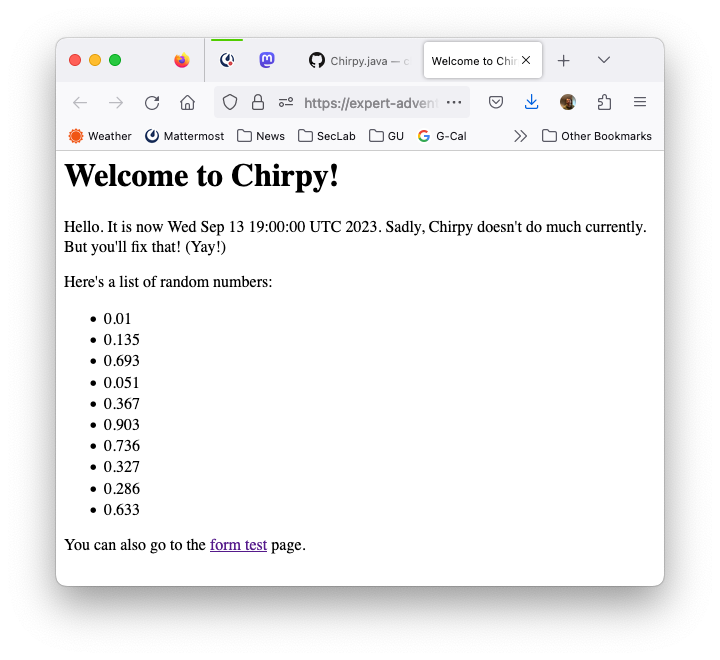
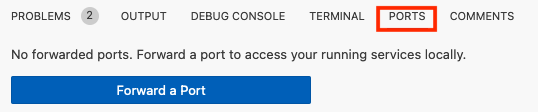
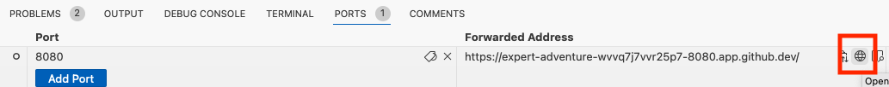
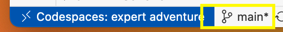

# chirpy

For the next few homework assignments, you will be incrementally building a Twitter-like service.  We've called our service Chirpy, but you should call yours something different.  Later in the semester, we'll get domain names for each group's service (e.g., chirpyposts.com).

Throughout this document, we'll be using the name Chirpy.  And yes, we know that Twitter is now called $\mathcal{X}$, but we're just not gonna call it that.  And no, we won't rebrand Chirpy as $\mathcal{C}$.

Super important note: This document won't magically update after you accepted the assignment.  If there are corrections, they won't appear here.  They will appear on [Prof. Sherr's GitHub repository](https://github.com/georgetown-cs-edu/chirpy), so be sure to check there frequently.  

<p> &nbsp; </p>

# When and for how much?

This homework assignment is due **October 9th** at 11:59pm ET.

It is worth 200 points, with the point values described towards the bottom of this (very long) README.

<p> &nbsp; </p>


# A Tour of Chirpy

## Assignment Goals

The goal of this assignment is to provide experiential learning in which students participate in a significant group project, working together to construct a sophisticated and complex software system.  Secondary goals include experience with the following:

* design documents;
* code documentation;
* adhering to style guidelines;
* test cases (see next homework assignment); 
* web programming; and
* source code management, including branching and merging


## What is Chirpy?

Chirpy is a Twitter-like service in which users, who are called *chirpers*, can post short messages or *chirps*.  Chirps can contain #hashtags, which are identified as any word that begins with a # symbol.

After logging in, the main screen for Chirpy is the *timeline*, which constitutes the logged-in chirpers's feed.  Populating the timeline are chirps from the logged-in user's *contacts*.  Contacts are fellow Chirpers.  

There is also a **search functionality**, where a Chirper can either:
1. type in the name of another Chirper and view that latter Chirper's chirps (unless that latter Chirper's profile is set to private; see note below); or 
2. search for posts that contain a given hashtag.

For example, a Chirper named `Micah1` can either search for Chirps from another Chirper, say, `DeGioia`, or for a hashtag, say, `#Georgetown`.


## Requirements

This project is purposefully left somewhat open ended (so that you may exercise your creativity!), and we've tried to keep the requirements minimal.  They are:

* You should work in groups of 3-5.

* You should give your service a name.  You can call it Chirpy if you like, or you can call it something else.  It'd be convenient for us (the teaching staff) if you have a group name (in Canvas) and a service name that are the same.

* Your implementation must implement the logic described in the previous section (i.e., allow Chirps, searching, etc.).

* Anyone can register for an account on Chirpy.  Chirpers have a username and a password.

* After registering, a chirper must log into the service using its correct username and password.

* A chirper's account is public by default (meaning that any logged in user can view their chirps), but can be set to private by that user, meaning that the chirper's chirps are only viewable by that chirper's contacts.

* You can specify a maximum length for Chirps, but it must be at least 128 characters.


## Extra Features

Additionally, your project should support at least one additional functionality:

* Moderation mode in which site operators can remove posts and suspend (and unsuspend) accounts.

* Support for full-text searching of chirps.

* Incorporate a database-backed backend to persist state.

* Support for uploading images or linking to videos in Chirps.

* Support for interacting with ChatGPT or other large language model chat bots.  (Talk to Prof. Sherr if you are attempting this, since it might cost money, and the instructor might be able to cover it.)

* Support for secure authentication/login cookies.  (See below.)

* Something clever that the teaching staff hasn't thought of.  This requires TA or instructor approval.


### A Brief Warning

Please don't blindly release your project to the world.  You should probably password protect it with a site-wide password.  (If you do that, you'll need to tell us what it is.)

Completely unmoderated social networks will quickly get overrun by horrible (and potentially illegal) content.  Running a real social network is expensive and difficult, and this course project isn't going to prepare you for that.


# Let's get into the details...

## Overall Structure

Chirpy is currently divided into three main packages:

* [data access object (DAO)](/src/main/java/edu/georgetown/dao/): contains classes that represent the various data objects for Chirpy.  These will likely include Chirper (a user), Chirp (a post), AuthenticationCookie (used to maintain state after logging in), among others.  

* [business logic layer (BLL)](/src/main/java/edu/georgetown/bll/): contains classes that implement the core logic of Chirpy.  This will likely include a UserRegistrationService, a UserAuthenticationService, a ChirpService, and a SearchService.  Consider this the place to put the core logic of your program.  The BLL will likely frequently make use of the data objects in the DAO package.

* [display logic (DL)](/src/main/java/edu/georgetown/dl/): contains classes that produce HTML for rendering the Chirpy website and interpret HTTP requests.

I have written skeleton code for each of these components.  I highly recommend that you start from this code, but you are free to deviate from it if you wish.

<p>&nbsp;</p>

# Deliverables, Part I: Writing a high-level design document

Your first task in this assignment is to construct a high-level design document for Chirpy (or whatever your group is calling your service).  The design document should be written in [Markdown](https://docs.github.com/en/get-started/writing-on-github/getting-started-with-writing-and-formatting-on-github/basic-writing-and-formatting-syntax).  (Click [here](https://docs.github.com/en/get-started/writing-on-github/getting-started-with-writing-and-formatting-on-github/basic-writing-and-formatting-syntax) for a good primer on Markdown; also, the file you're reading now is written in Markdown, so see that for a good example.)

Your high-level design document should:

* List and briefly describe the functionalities supported by Chirpy.  This should include, for example:
  * adding a new user and setting its password
  * submitting a chirp
  * rendering a timeline
  * searching for chirps via hashtag
  * searching for chirps via chirper (i.e., searching for `MicahSherr1`'s chirps)
* Describe the classes that make up the DAO.  Class descriptions should include all of the "public" functions that will be used by the BLL.  For example, a User class might include functions such as:
  * `void setUsername( String username )`
  * `String getPassword()`
* Class descriptions should include the method names (i.e., the API) and brief descriptions of what each does and what the parameters and return values are.
* Your design document should describe how the various class objects will be stored.  Initially, you may store everything in memory (yikes!) -- e.g., registered users could persist in a [Vector](https://docs.oracle.com/javase/8/docs/api/java/util/Vector.html) or [HashMap](https://docs.oracle.com/javase/8/docs/api/java/util/HashMap.html).  Be sure to also describe how a chirper's contacts are stored/maintained.
* Describe what your cookies look like (see below).
* Similarly, describe the classes that make up the BLL.  Here, classes will refer to your service's main *functionalities*.  For example, you might have a classes called `SearchFunctionality` and `ChirpHandler`.

The design document should exist as a single Markdown file called `DESIGN.md`, and be stored in the top level of your repository (i.e., next to this `README.md` file).

<p>&nbsp;</p>

# Deliverables, Part II: The beginnings of Chirpy

The second (and final) deliverable for this assignment is a functioning user registration and user listing service.  **YOU DO NOT HAVE TO BUILD OTHER COMPONENTS OF CHIRPY FOR THIS ASSIGNMENT.  JUST DO THE USER REGISTRATION AND USER LISTING SERVICES.**

The requirements are:

### Adding users

Your service should allow a user to navigate to `https://yourdomain/register/` and be presented with a registration form.  See below for information about hosting the site and skeleton code that is written for you.  Don't panic if you haven't done web programming before -- much of this is already written for you, and there are examples.  

The registration form should, at a minimum, ask the user for a username, password, and ***password confirmation*** (i.e., they need to enter their password twice).  Your code should check that the two passwords match and that the user doesn't already exist -- and alert the user if either condition applies.

Assuming the passwords match and this is a new registration, your service should then "create" the new user.  What "create" means is up to you, but it should at minimum mean that there's some instantiation of this user that is kept in memory.

Your program should not impose an artificial limit (i.e., hardcode) on the number of users that may register.  If storing user information in memory, you should use a dynamic data structure such as a [Vector](https://docs.oracle.com/javase/8/docs/api/java/util/Vector.html) or [HashMap](https://docs.oracle.com/javase/8/docs/api/java/util/HashMap.html).

### Listing users

Second, to make testing easier for us, you should also support a page, say `https://yourdomain/listusers/`, that (as the name implies) lists all of the registered users on the system.

### Logging in

Finally, your application should support a login in screen, say at `https://yourdomain/login/`, that prompts for a username and password.  If, and only if, the user enters a username and password of a previously registered chirper, then your application should indicate that logging in was successful; otherwise, an error message should be shown.

Importantly, if the login was successful, your implementation of Chirpy should send a [cookie](https://en.wikipedia.org/wiki/HTTP_cookie) to the user's browser.  The cookie is a small piece of data that the web service (i.e., Chirpy) stores on the user's computer.  Specifically, this cookie will be an *authentication cookie*, meaning that it will contain the user's identity (i.e., username).  

The nice thing about cookies are that whenever the user returns to the site, the browser automatically sends the user's cookies (belonging to that site) to the site's webserver.  This means that Chirpy will receive such a cookie, and can thus effectively "remember" that the user is logged in.  This will be important later when the user navigates to pages for sending chirps or searching chirps.

There's sample code for setting and retrieving cookies.  See below.


## Outside resources

Following course policy, you are allowed to use ChatGPT and other large language models for this project.  However, you must identify all cases in which these are used.

You may also use outside libraries, with the following conditions.  You must request the use of the library on Ed Discussion and receive the approval of a TA or the instructor.  The library must be free, open-source software.  And, you should update your design document to properly cite the library.


# A tour of the skeleton code

The exemplar Chirpy code lives in the `edu.georgetown` package.  You are free to use a different package name if you like.  The BLL, DAO, and DL components are respectively in the packages `edu.georgetown.bll`, `edu.georgetown.dao`, and `edu.georgetown.dl`.  

## public static void main(String[] args)  

Let's start "at the top" and look at the [main](src/main/java/edu/georgetown/Chirpy.java) method from `Chirpy.java`:

```java
    public static void main(String[] args) {

        Chirpy ws = new Chirpy();
        // let's start up the various business logic services
        UserService userService = new UserService(ws.logger);

        // finally, let's begin the web service so that we can start handling requests
        ws.startService();
    }
```

The function initializes the UserService (which doesn't do much... you'll need to fill that in) and then starts the web service.  Let's look at an abridged copy of the `startService` function (again, defined in [Chirpy.java](src/main/java/edu/georgetown/Chirpy.java)):

```java
    private void startService() {
        try {
            // initialize the web server
            HttpServer server = HttpServer.create(new InetSocketAddress("localhost", PORT), 0);

            // each of these "contexts" below indicates a URL path that will be handled by
            // the service. The top-level path is "/".
            server.createContext("/formtest/", new TestFormHandler(logger, displayLogic));
            server.createContext("/", new DefaultPageHandler(logger, displayLogic));
            // you will need to add to the above list to add new functionality to the web service

            // [...]

            server.start();
        } catch (IOException e) {
          // [...]
```
This is the core of Chirpy.  It creates a server object, which is going to handle all of the web server communication for you.  The important part is below, where we have the ability to create `Contexts`, which you can conceptualize as functions that handle specific URLs.  For example, the [TestFormHandler](src/main/java/edu/georgetown/dl/TestFormHandler.java) class handles the URL `https://yourdomainname.com/formtest/`.  Whenever someone navigates to that, the `handle` method of [TestFormHandler](src/main/java/edu/georgetown/dl/TestFormHandler.java) is called.  The default (top) page of a website is "/" -- the [DefaultPageHandler](src/main/java/edu/georgetown/dl/DefaultPageHandler.java) class handles that one.  Both [TestFormHandler](src/main/java/edu/georgetown/dl/TestFormHandler.java) and [DefaultPageHandler](src/main/java/edu/georgetown/dl/DefaultPageHandler.java) are located in the [dl](src/main/java/edu/georgetown/dl/) directory because these are functions that handle the site's display logic.

So, to support new paths/contexts/URLs, just add a new class in the [dl](src/main/java/edu/georgetown/dl/) directory and add a corresponding `server.createContext` call in [startService](src/main/java/edu/georgetown/Chirpy.java).

## Templates

OK, let's take a look at one of these page handlers.  We'll examine the `handle` function of [DefaultPageHandler](src/main/java/edu/georgetown/dl/DefaultPageHandler.java).  Here it is, in its entirety:

```java
    private final String DEFAULT_PAGE = "toppage.thtml";

    @Override
    public void handle(HttpExchange exchange) throws IOException {
        logger.info("DefaultPageHandler called");

        // sw will hold the output of parsing the template
        StringWriter sw = new StringWriter();
        // dataModel will hold the data to be used in the template
        Map<String, Object> dataModel = new HashMap<String, Object>();

        {
            // I'm putting this in a code block because it's really just demo
            // code. We're populating the dataModel with some example data
            // that's not particularly useful

            // the "date" variable in the template will be set to the current date
            dataModel.put("date", new Date().toString());
            // and randvector will be a vector of random doubles (just for illustration)
            Vector<Double> v = new Vector<Double>();
            for (int i = 0; i < 10; i++) {
                v.add(Math.random());
            }
            dataModel.put("randvector", v);
        }

        // now we call the display method to parse the template and write the output
        displayLogic.parseTemplate(DEFAULT_PAGE, dataModel, sw);

        // set the type of content (in this case, we're sending back HTML)
        exchange.getResponseHeaders().set("Content-Type", "text/html");
        // send the HTTP headers
        exchange.sendResponseHeaders(200, (sw.getBuffer().length()));
        // finally, write the actual response (the contents of the template)
        OutputStream os = exchange.getResponseBody();
        os.write(sw.toString().getBytes());
        os.close();
    }
```

The `@Override` thing at the top is a compiler directive.  It indicates that the method is supposed to override a method from a superclass (in this case `HttpHandler`).  If it doesn't, that's a programmer error and the compiler should fail to compile it.  That's another example of "fail early."

In a nutshell, what this function does is that it displays the contents of [toppage.thtml](resources/templates/toppage.thtml).  This file is called a *template*.  Along with all of the other templates (including the ones you'll be adding), it is located in the [resources/templates/](resources/templates/) directory.  Let's take a quick glance at the part of the template, which is mostly HTML.

```html
        <p>
            Hello.  It is now ${date}.  Sadly, Chirpy doesn't do much currently.  But you'll fix that!  (Yay!)
        </p>

        <p>
            Here's a list of random numbers:
            <ul>
                <#list randvector as randNum>
                    <li>${randNum}</li>
                </#list>
            </ul>
        </p>
```
In particular, there's this thing on the second line -- `${date}`.  Anything of the form `${varname}` is a variable which your Chirpy service is going to replace before it sends the HTML back to the user's browser.  In other words, the template defines what the page is going to look like, and parts that are going to be generated *dynamically* by the server are variables.

Let's focus for a second on these two lines from the `handle` function (from above):
```java
Map<String, Object> dataModel = new HashMap<String, Object>();
// [...skipping some stuff...]
dataModel.put("date", new Date().toString());
```

The first line defines a Map.  Other languages sometimes call these associative arrays, key-value stores, dictionaries, and hash tables.  The basic concept is simple: you put in a *(key,value)* pair, where *key* and *value* can be pretty much any Java `Object` (i.e., any Java class), and it stays in your dictionary.  You can then query based on the key -- there's a corresponding `get` method that takes the *key* and returns the corresponding *value*.  If you're new to Maps, you should take a quick look [at this tutorial](https://www.w3schools.com/java/java_hashmap.asp).

(As a nit, the above Map call restricts the keys of this particular `dataModel` object to be `String`s.)

Getting back to the lines above, `dataModel.put()` adds a new entry to the `dataModel` hash table, where the key is the string "date" and the value is the current time (which we get via `new Date().toString()`).  Looking back at the template, this is going to cause `${date}` to be replaced with the value in the `dataModel` hash table whose key is `date`.  

Let's look at some more code from the `handle` function:
```java
            Vector<Double> v = new Vector<Double>();
            for (int i = 0; i < 10; i++) {
                v.add(Math.random());
            }
            dataModel.put("randvector", v);
```
Here, we're creating a vector of doubles.  There are 10 of them, and each is a random value.  We then add the vector (as the value) to the hashmap using the key `randvector`.  

Returning to the template, let's look at these lines:
```html
            Here's a list of random numbers:
            <ul>
                <#list randvector as randNum>
                    <li>${randNum}</li>
                </#list>
            </ul>
```
The `<#list randvector as RandNum>` defines an `iterator`, which is a thing that loops through a list.  Specifically, it says, "let's iterate through the list `randvector`. In each iteration, let `randNum` be the next element from the list."  The loop is bookended by the `<#list...>` and `</#list>` tags, as you can see above.  Effectively, the above code will produce a `<li>...</li>` HTML tag (i.e., a list item) for each element of `randvector`.  

Loading the top page from a web browser, we see this all come together:



Let's revisit the `handle` function one more time.  Specifically, let's look at this code block:
```java
        // now we call the display method to parse the template and write the output
        displayLogic.parseTemplate(DEFAULT_PAGE, dataModel, sw);

        // set the type of content (in this case, we're sending back HTML)
        exchange.getResponseHeaders().set("Content-Type", "text/html");
        // send the HTTP headers
        exchange.sendResponseHeaders(200, (sw.getBuffer().length()));
        // finally, write the actual response (the contents of the template)
        OutputStream os = exchange.getResponseBody();
        os.write(sw.toString().getBytes());
        os.close();
    }
```
Each web page handler will have a stanza like this, and you probably don't want to change it.  The `parseTemplate` function does the hard work of parsing the template with the provided `dataModel`.  What you DO want to do is populate the `dataModel` with whatever dynamic content you'll want to display to the user.

The rest of the code above does boilerplate things -- it sends the response code to 200, which signals your web browser that its request to retrieve the page was successful (from the server's point of view).  It then writes the processed template to a buffer which is eventually shipped to the user's browser.  Again, this is code you probably do not want to change.

## Cookies

As mentioned above, you'll need to support [cookies](https://en.wikipedia.org/wiki/HTTP_cookie), which are small pieces of data that the web service (i.e., Chirpy) puts onto the user's browser.  Cookies are needed because you need to maintain *state*.  Consider, for example, a user who logs in via the login page, and then goes to the search page.  The server needs to somehow remember who this user is.  The way that we do this is to send a *session cookie* to the browser.  The browser then sends this session cookie back to the server on every page visit -- this is something automatic that your browser does.  

This means that you'll need some mapping between session cookies and users.  A session cookie could contain a user's username, for example.  *An aside:* Such a design would be HORRIBLY insecure, as any knowledgeable user could change their session cookie to contain another user's username, and thus "become" them without knowing their username and password.  As your "extra" feature, you can look into implementing a more secure cookie design.

For cookies, we're giving you some exemplar code, both for setting and retrieving cookies.  Specifically, look at [ListCookiesHandler.java](src/main/java/edu/georgetown/dl/ListCookiesHandler.java) and [showcookies.thtml](resources/templates/showcookies.thtml).  These respectively define the logic and the layout of the `/listcookies/` (don't forget the trailing `/`) page, which lists the cookies.  Note that the [TestFormHandler](src/main/java/edu/georgetown/dl/TestFormHandler.java) sets the actual cookie by calling the `displayLogic.addCookie()` function.


## I have a headache.  What do I need to do again?

Let's review what you need to do:

* For each new "page" you want to add to Chirpy -- where a page could be the search page, search results page, add a chirp page, etc. -- you'll need to create a new template.  This will mostly be written in HTML, but with template variables thrown in where needed to handle the dynamic content.
* For each new "page", you'll also need to create a new class and stick it in the [dl](src/main/java/edu/georgetown/dl/) directory.  Specifically, this class should populate a `dataModel` hashmap with whatever dynamic content you need.
* When your code needs to do something big, like add a user, conduct a search, etc., you should separate out the business logic from the display logic.  The display logic should handle outputting the results to the user.  The business logic should actually perform the action, such as adding a new chirper to the system, or conducting a search (and returning the results).  This latter business logic should be done as classes, which you'll put in the [bll](src/main/java/edu/georgetown/bll/) directory.  (There's a very simple skeleton of a UserService that's there already for you to take a look at.)
* Don't forget to register the handler in [Chirpy.java](src/main/java/edu/georgetown/Chirpy.java).  You will register it by adding a new `server.createContext(...)` line.


# Running Chirpy

You can run Chirpy from inside your Codespaces environment and access the web service via your web browser.

To run Chirpy, either press F5 when you have `Chirpy.java` open, or select "Start Debugging" from the left-hand side "hamburger" menu.  

To actually access Chirpy using your web browser, you'll need to set up "port forwarding".  (This is necessary because Chirpy is running inside of a VM located in GitHub's servers; you need to allow outside access to it.)  To do that, click on the PORTS tab at the bottom of your Codespaces environment:



Then, click on "Forward a Port".

Enter `8080` as the port number.  Hit Enter.

You'll see something appear under "Forwarded Address".  That's the URL that you'll need to access Chirpy.  It's dependent on your particular Codespaces environment, and will stop working when Codespaces is shutdown.  It's also hard to type.  If you hover over it with your mouse, a globe icon will pop up.  If you click that, it'll open in your browser.  (Of course, Chirpy should be running first.  If you didn't run it, there's nothing that will "respond" to your web browser.)

<p></p>
  
*Note*: The Port Forwarding portion of Codespaces allows you to set it as private (the default) or public.  If it's private, only you (the person logged into GitHub) can access it.  If you want to open it up to the world, set it to public.


# Using branches

Each group member should have a separate branch on which they will work.  We are **requiring** that each student work in their own branch and not directly on the `main` branch.  However, once ready, students should switch to `main` and merge in the changes from their individual branches.   

We will deduct points if students do not work in their own branches.  Part of the purpose of this homework is to learn good source code management techniques, including how to effectively use `git`.

As a reminder, students can create a branch by clicking on the bottom-left side in Codespaces where it says "main" (or whatever branch the student is currently using):



Once clicked, select "Create a branch".

Note that it's very important that students publish their own branches to github.  That is, after committing on your new branch, make sure that select "Publish Branch" under the left-hand source control menu.


<p>&nbsp;</p>

# Group dynamics

You and your groupmates should work as a team.  The teaching staff isn't well-positioned to interpret who did what, and you'll all be receiving the same grade for this assignment.

If there are issues with teammates, you should reach out to a member of the teaching staff as soon as possible via **private** message on Ed or through email.

It's up to your group to figure out how to split the work.  A reasonable approach might be:

* Person A: Project manager.  Reviews ALL code and decides what gets added to the `main` branch
* Person B: Frontend engineer.  Responsible for creating the templates for the various Chirpy pages
* Person C: Backend developer.  Implements the business logic components for adding users.
* Person D: Backend developer.  Implements the "extra" requirement for this project.

All group members should work collaboratively on the design document, as it will affect all aspects of this project.


# Submitting your project

As with all assignments in this class, you'll be submitting via GitHub.  To share with the instructors and the TAs, you should push your code to the `main` branch of your repository.

# Grading rubric

This homework assignment is worth 200 points, split evenly between the design document (100 points) and the implementation (also 100 points).

### Design document

Potential deductions include, but are not limited to:
* -15: incorrect format.  The design document should be saved as a Markdown file and be called DESIGN.md.
* up to -30: core functionalities are not described.  The design document should describe the mechanisms for each of the major functions of the service, even those that are NOT required for Part II (the implementation).
* up to -15: omissions in the DAO
* -15: no mention of how state (e.g., list of users) will be maintained
* -10: no mention of how cookies are used

### Implementation

Potential deductions include, but are not limited to:
* up to -50: does not successfully implement required functionality
  * -7: doesn't check that user's password matches during registration
  * -15: password authentication does not work
* -40: does not implement "extra" functionality (see above)
* up to -20: program instability / crashes
* up to -10: failure to adhere to class code style guidelines
* -5: frequent use of meaningless commit messages (e.g., "did stuff"); this is bad style
